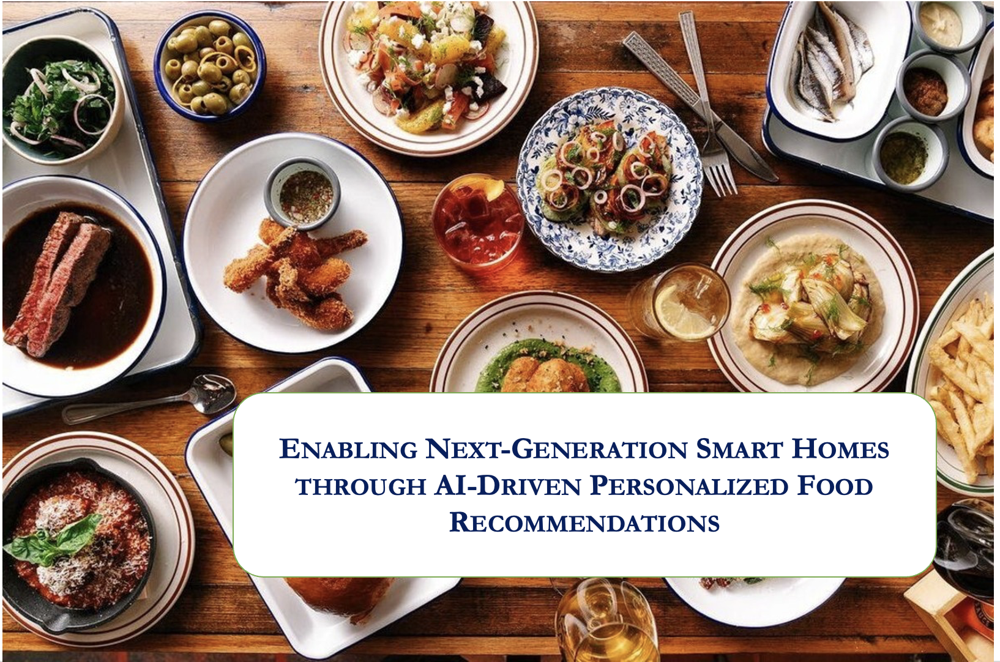
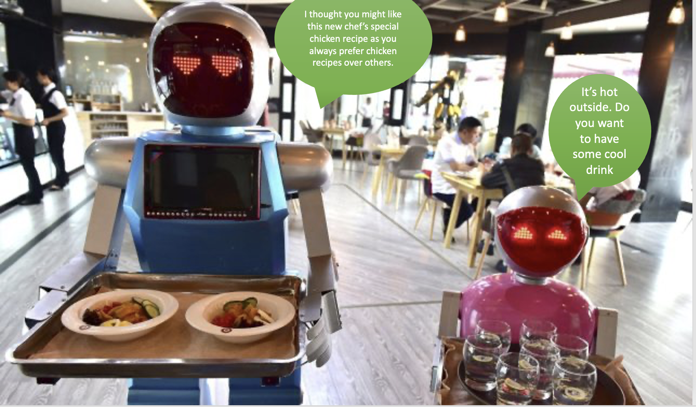
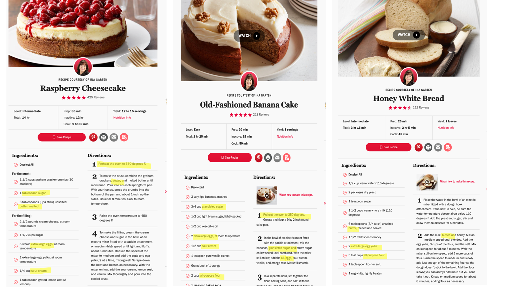

# BERT Based Food Recommendation Systems _ RecipeBert
 
## Introduction:

#### Abstract:
The rapid proliferation of advanced AI technologies has propelled numerous industries forward, but the smart home sector has yet to realize its full potential in the next-generation landscape. A true smart home transcends mere automation, becoming an entity that comprehends and anticipates residents' needs, providing timely and personalized services. This research paper explores the paradigm of a fully intelligent home environment, where residents enjoy a hospitality-like experience while their smart home proactively serves their requirements. One such service can be offering customized food suggestions for daily meals, considering individual preferences, cultural influences, weather conditions, dietary restrictions, and an inclination to explore novel recipes. Our proposed system leverages a state-of-the-art NLP Bert model-based similarity prediction approach to rank recipes based on word and contextual similarities. Recipes that have common ingredients and preparation methods are categorized as similar, while those differing in ingredient types and cooking techniques are classified as not similar. By analyzing 'n' days of historical eating habits, the system generates a curated selection of the top 'k' recipes while avoiding repetition by excluding products consumed within the recent 'm' days (here m<<<<n).

## Item to Item Similarity model
Important Key Points in Cooking:
- Ingredients : Items used to make the recipe like chicken, tamato, pasta, chocolate, sugar etc 
- Cooking  process: Baking, deep fry, cooking in water, grinding 

#### A simle question for you:
    Why do you think NLP is the way to  go for this problem. Why not traditional models like user to user
    recommendation models ? or feature based recommendation models ? 

- The project is relatively new ( less than 2 years), this solution is perfect to handle limited historical user data case.
- Simple solutions that require minimal feature engineering and allow for the straightforward addition of new items to the system (like simple addotion of openly available new recipe text).

#### Lets try an other one:
    OK all great. NLP is the way. But which transformer architecture to choose? Encoder / Decoder/
    Encoder-decoder? 

- BERT typically perform better on specific tasks rather than general ones. In the context predicting recipes(sentence) similarity similarity a specialized approach using a model like BERT could be quite effective.

### Why Bert?
1] Ingredients similarity - Word similarity: 
    When ingredients are similar they both high likily to have similar taste. For Example: chicken lovers, and dessert (sugar) lovers.
2] Procedure similarity - Semantic similarity: 
    If the cooking process is similar, they both likily to have similar texture and taste. Example: Baking foods, No cooking food(Salads), Food/ Half cooked eggs.

## Sentence Bert Architecture Overview/ Sudo Code:

#### Bert:

    #### Algorithm 9: P ← ETransformer(x|θ)
    /* BERT, an encoder-only transformer, forward pass */

    Input: x ∈ V*, a sequence of token IDs.
    Output: P ∈ (0,1)^Nxlength(x), where each column of P is a distribution over the vocabulary.
    Hyperparameters: e_max, L, H, de, dmIp, df ∈ ℕ
    Parameters: θ includes all of the following parameters:
        W_e ∈ ℝ^deXN, W_p ∈ ℝ^deXe_max, the token and positional embedding matrices.
        For l ∈ [L]:
            | W_l, multi-head attention parameters for layer l, see (4),
            | γ_l^1, β_l^1, γ_l^2, β_l^2 ∈ ℝ^de, two sets of layer-norm parameters,
            | W_l^mpl1, b_l^mpl1 ∈ ℝ^dmIpXde, b_l^mpl1 ∈ ℝ^dmIp, W_l^mpl2 ∈ ℝ^deXdmIp, b_l^mpl2 ∈ ℝ^de, MLP parameters.
        W_f ∈ ℝ^dfXde, γ, β ∈ ℝ^df, the final linear projection and layer-norm parameters.
        W_u ∈ ℝ^Nxde, the unembedding matrix.

    1 ℓ ← length(x)
    2 for t ∈ [ℓ] : e_t ← W_e[:,x[t]] + W_p[:,t]
    3 X ← [e1, e2, ... e_ℓ]
    4 for l = 1, 2, ..., L do
    5    X ← X + MHAttention(X|W_l, Mask = 1)
    6    for t ∈ [ℓ] : X[:,t] ← layer_norm(X[:,t]|γ_l^1, β_l^1)
    7    X ← X + W_l^mpl2 GELU(W_l^mpl1 X + b_l^mpl1 1^T) + b_l^mpl2 1^T
    8    for t ∈ [ℓ] : X[:,t] ← layer_norm(X[:,t]|γ_l^2, β_l^2)
    9 end
    10 X ← GELU(W_f X + b_f 1^T)
    11 for t ∈ [ℓ] : X[:,t] ← layer_norm(X[:,t]|γ, β)
    12 return P = softmax(W_u X)

#### Lets try one more:
    Why cannot we use Bert directly for sentence similarity. What is the need of new architecture so a different transformer?
    hint: Think in terms of computation. What is the time complexicity for a dataset of size n  

- Finding the two most similar sentences in a dataset of n. This would require us to feed each unique pair through BERT to finds its similarity score and then compare it to all other scores. For n sentences would that result in n(n — 1)/2. This turns out to be a real problem if you are trying to integrate this in a real-time environment. A small dataset of only 10,000 sentences would require 49,995,000 passes through BERT, which on a modern GPU would take 60+ hours! This obviously renders BERT useless in most of these scenarios

#### Sentence bert: 
    # Input
    sentences = [s1, s2, ..., sN]  

    ERT initialization
    t = BERTModel()  
    
    iamese BERT network
    rt = SiameseBERT(bert)
    
    rain with regression/triplet loss  
    in(sbert, sentences, labels)  
    
    enerate embeddings
    eddings = []
     s in sentences:
     emb = sbert(s) 
     embeddings.append(emb)
    
    ompute similarity  
     = cosine_similarity(embeddings[i], embeddings[j])

SentenceBERT twin architecture configured for classification.

#### Item to Item Similarity Prediction using Bert:

Simple steps:
1] Tune your Bert model. Pass sentences, and convert them into embeddings.
2] Calculate the distance between sentence embeddings using Euclidean or cosine similarity.
3] We now have a measure of semantic similarity between sentences. 

## Code Demonstraction
https://colab.research.google.com/drive/1P1WGhn-EhVT1YC5W74A1fM-jqV0s5J9l

## Critical Analysis:
#### Is the item to item recommendtaion is just enough for a smart home application?
Recommendations models always work great if we have user to user, item-to-item both, Complementary models(in few cases).
- Writer was not able to integret other method becuase of their users data constrains. But this method can perfectly be implimented in item to item similarity use cases. Example: Doordash showing similar items when user searched for an item. 
- Writer wants to integrat other recommendtaions method in their future work. 
The model is not validated based on real environment with real users recommendtaion data and it's only validated based on survey's data. Final validation is still pending. 
- Planning to do as a part of next phase of work.
Comparison with chatGPT chain of thoughts. Can this very generalized model provide better score than bert ?  Other try any other encoder decoder model. 
- Involving chatGPT increases the project maintance budget. This simple task should not have high maintaince cost. There is also a scopre for data privacy issues. 
- Encoder & decoder performance validation. We tried it, but with in our resource limitations, we were not able to achieve similar results. Planning to do further evaluation as a part of future work.
        

## Repo:

https://github.com/DivyaMereddy007/RecipeBert/tree/main/RecipeBert

## Video Recordings: 
https://www.youtube.com/watch?v=9aUtnod9zqE&t=453s

## Resources Links: 
[1]	Item-based Collaborative Filtering with BERT ,Yuyangzi Fu,Tian Wang, https://aclanthology.org/2020.ecnlp-1.8.pdf
[2] https://www.pinecone.io/learn/series/nlp/sentence-embeddings/
[3] https://medium.com/dair-ai/tl-dr-sentencebert-8dec326daf4e
[4] https://www.coursera.org/learn/convolutional-neural-networks/lecture/bjhmj/siamese-network

## Citations:
Paper: MEREDDY DIVYA. (2023). ENABLING NEXT-GENERATION SMART HOMES THROUGH AI-DRIVEN PERSONALIZED FOOD RECOMMENDATIONS. https://doi.org/10.5281/zenodo.8015512 
[1]	Item-based Collaborative Filtering with BERT ,Yuyangzi Fu,Tian Wang, https://aclanthology.org/2020.ecnlp-1.8.pdf
[2]	Nils Reimers, Iryna Gurevych, Sentence-BERT: Sentence Embeddings using Siamese BERT-Networks, https://arxiv.org/pdf/1908.10084.pdf
[3]	Nusrat Jahan Prottasha, Abdullah As Sami, Md Kowsher, Saydul Akbar Murad, Anupam Kumar Bairagi, Mehedi Masud, and Mohammed Baz, Transfer Learning for Sentiment Analysis Using BERT Based Supervised Fine-Tuning, https://www.ncbi.nlm.nih.gov/pmc/articles/PMC9185586/
[4]	Vishnu Nandakumar, Recommendation system using BERT embeddings, https://medium.com/analytics-vidhya/recommendation-system-using-bert-embeddings-1d8de5fc3c56
[5]	D. Viji, and S. Revathy, A hybrid approach of Weighted Fine-Tuned BERT extraction with deep Siamese Bi – LSTM model for semantic text similarity identification, https://www.ncbi.nlm.nih.gov/pmc/articles/PMC8735740/
[6]	Xingyun Xie, Zifeng Ren, Yuming Gu and Chengwen Zhang, Text Recommendation Algorithm Fused with BERT Semantic Information, https://dl.acm.org/doi/abs/10.1145/3507548.3507582
[7]	Itzik Malkiel , Dvir Ginzburg, Oren Barkan, Avi Caciularu, Jonathan Weill, Noam Koenigstein, Interpreting BERT-based Text Similarity via Activation and Saliency Maps, https://dl.acm.org/doi/abs/10.1145/3485447.3512045
[8]	Allyson Ettinger, What BERT Is Not: Lessons from a New Suite of Psycholinguistic Diagnostics for Language Models. https://direct.mit.edu/tacl/article/doi/10.1162/tacl_a_00298/43535/What-BERT-Is-Not-Lessons-from-a-New-Suite-of
[9]	Semantic Similarity with BERT, https://keras.io/examples/nlp/semantic_similarity_with_bert/#inference-on-custom-sentences
[10]	James Briggs, BERT For Measuring Text Similarity, https://towardsdatascience.com/bert-for-measuring-text-similarity-eec91c6bf9e1
[11]	PAUL MOONEY , RecipeNLG (cooking recipes dataset, https://www.kaggle.com/code/paultimothymooney/explore-recipe-nlg-dataset
[12]	Kashish Ahuja, Mukul Goel, Sunil Sikka, and Priyanka Makkar, What-To-Taste: A Food Recommendation System, https://papers.ssrn.com/sol3/papers.cfm?abstract_id=3670234
[13]	Yasmin Beij, A Literature Review on Food Recommendation Systems to Improve Online Consumer Decision-Making, https://edepot.wur.nl/526224
[14]	Luís Rita, Building a Food Recommendation System, Towards data science, https://towardsdatascience.com/building-a-food-recommendation-system-90788f78691a
[15]	Thi Ngoc Trang Tran, Müslüm Atas, Alexander Felfernig, and Martin Stettinger , Journal of Intelligent Information Systems volume 50, pages 501–526 (2018), An overview of recommender systems in the healthy food domain, https://link.springer.com/article/10.1007/s10844-017-0469-0
[16]	Pratiksha Ashok.Naik, International Journal of Innovative Science and Research Technology, ISSN No:-2456-2165, Volume 5, Issue 8, August – 2020 
[17]	Florian Pecune1*, Lucile Callebert1 and Stacy Marsella1, Designing Persuasive Food Conversational Recommender Systems With Nudging and Socially-Aware Conversational Strategies, https://www.frontiersin.org/articles/10.3389/frobt.2021.733835/full
[18]	RECIPE COURTESY OF INA GARTEN, https://www.foodnetwork.com
[19]	https://arxiv.org/pdf/1904.06690.pdf
[20]	https://paperswithcode.com/dataset/recipenlg#:~:text=The%20benchmarks%20section%20lists%20all,Homepage%20Benchmarks%20Edit
[21]	https://www.researchgate.net/publication/345308878_Cooking_recipes_generator_utilizing_a_deep_learning-based_language_model

